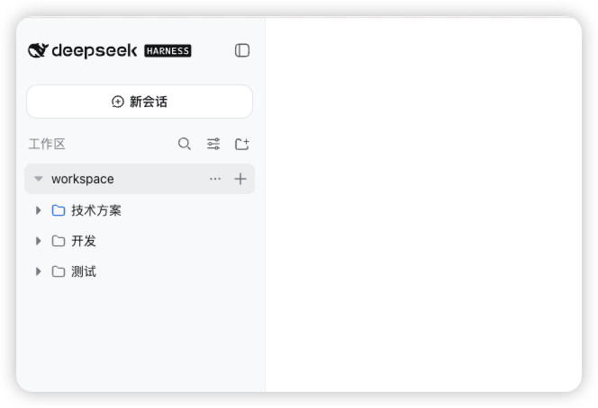

# dsh 会话分类插件

[English](README.md) | 中文

会话分类插件为 dsh 侧边栏提供用户自定义的分类树。每个 Workspace 拥有独立的分类，每个会话最多归属于一个分类。

该包包含 Host 入口、Web Client bundle 和 Cordis profile patch，不需要额外安装 Client 或 Bundle 包。

## 界面预览

侧边栏会将会话放入清晰的、可展开和折叠的分类容器中。下图展示了当前插件布局中的 Workspace、分类和会话层级关系。



在 Workspace 中可以：

- 直接在分类下新建会话；
- 展开或折叠分类，同时保留清晰的层级关系；
- 将会话拖拽到其他分类；
- 通过 Workspace 操作菜单新建一级分类；
- 通过分类操作菜单新建子分类，或重命名和删除当前分类；
- 使用带文件夹图标的“移动到分类”操作移动会话。

展开的分类使用嵌套容器，每级增加固定缩进。会话在所属分类基础上再缩进一级，拖拽目标高亮不会改变行尺寸。折叠的 Workspace 包含分类或会话时会显示层级提示图标。

## 从 GitHub 安装

请先确保当前 shell 中可以使用 `dsh` 命令，然后将预构建插件直接安装到未修改的 dsh Web profile：

```sh
dsh plugin --profile web add dsh-session-categories
dsh --profile web
```

如果你是在 dsh 源码仓库中运行，则使用源码仓库提供的 package launcher：

```sh
pnpm dsh plugin --profile web add dsh-session-categories
pnpm dsh --profile web
```

仓库已包含生成后的运行时文件，不需要额外构建插件。

如果需要安装尚未发布的 GitHub 版本，可以直接从仓库安装：

```sh
dsh plugin --profile web add github:ht719/dsh-session-categories
```

## 行为与数据

递归删除分类会归档其中的会话，不会删除会话的持久化日志。归档重试会复用同一个 operation id，进程重启后可以恢复。过期 revision、跨 Workspace 会话、移动到自身后代以及未知分类的操作都会被拒绝。

## 兼容性

插件面向当前 dsh 预发布版本的插件 API，目标是在未修改的 dsh 安装中工作。dsh 预发布版本不承诺跨版本兼容，升级时请同时更新 dsh 和本插件。

## 源码布局

仓库根目录是可安装的预构建包。源码分别保留在 `packages/workspace/session-categories/`、`packages/client/ui-session-categories/` 与 `packages/bundle/session-categories/`。

插件作为普通 Cordis 行组合，不要求修改 `ui-workspace`、`ui-slots`、`api-remotes` 或其他 dsh 核心包。
